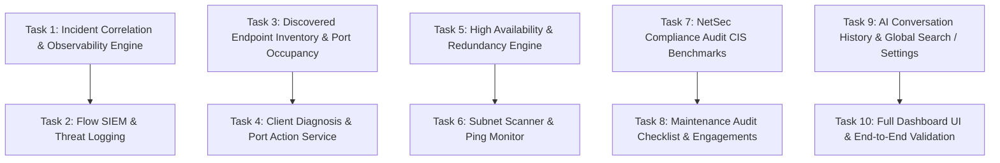

# SentinelNet to Go: Comprehensive Multi-Task Porting Plan

## Overview
Analysis of the source Python repository (`SentinelNet`, ~84 `.py` files) and the destination Go repository (`sentinelnet-go`, Go 1.26 pure-Go static binary) shows that **core foundations are complete and verified** (Auth, JWT, Vault AES-GCM, Identity Manager, Inventory, SQLite WAL store, Drivers, Topology & Visio `.vsdx` export, MAC/ARP tracker, Config & Firewall/WLC Analyzer, Day-0 Provisioner SSH/Serial, Remote Sites & Agents, Base Observability Ingest UDP IPFIX/sFlow/Syslog, AI Provider core & MCP server/client).

This plan structures the porting of all **remaining capabilities** into modular, test-driven, incremental tasks using pure-Go native tools (no CGO, standard library + existing dependencies).

---

## Architectural Principles & Go Native Tech Stack

1. **Single Static Binary (Zero CGO)**:
   - Database: `modernc.org/sqlite` (pure Go SQLite with WAL mode & embedded SQL migrations).
   - HTTP routing: `github.com/go-chi/chi/v5`.
   - WebSockets: `github.com/coder/websocket`.
   - Document exports: `archive/zip` + `encoding/xml` for Office Open XML (`.docx` and `.vsdx`).
   - Concurrency: Go native goroutines, buffered channels, `sync.Mutex`, `golang.org/x/sync/errgroup`.
   - Networking & Probing: `net`, `net/http`, `golang.org/x/crypto/ssh`, `go.bug.st/serial`.
2. **Strict API & JSON Contract Parity**:
   - Every `/api/...` endpoint must match field-for-field with FastAPI response schemas so `web/dashboard.html` and modular frontend scripts work seamlessly.
3. **Tenant Scoping & Security First**:
   - Reuse existing `assertDeviceAllowed` and `user_group_scope` in `internal/api/middleware.go`.
   - Pass all outbound payloads to LLMs / external endpoints through `internal/redact/redact.go`.

---

## Multi-Task Implementation Roadmap

---

## Detailed Task Breakdown

### Task 1: Incident Correlation & Observability Engine
**Source**: `observability/incidents.py`, `observability/rules.py`, `observability/timeline.py`, `observability/flowpath.py`, `observability/suppression.py`, `observability/baseline.py`, `routers/incidents.py`

- **Components**:
  - `internal/observability/rules/`: Deterministic rule catalog and evaluators (`IFACE_FLAPPING_001`, `MAC_MOVE_LOOP_001`, `FLOW_SPIKE_001`, `SCAN_SWEEP_001`, `DNS_TUNNEL_001`, `EXFIL_VOLUME_001`, `FW_DENY_SURGE_001`).
  - `internal/observability/timeline/`: Multi-source event timeline assembler (Flows, Syslog, SNMP, Link transitions).
  - `internal/observability/flowpath/`: Hop-by-hop path tracer from MAC/ARP/CDP topology.
  - `internal/observability/suppression/`: Maintenance window & suppression schedule evaluator.
  - `internal/obsstore/incidents.go`: SQLite tables `incidents`, `incident_conclusions`, `evidence`, `events`.
  - `internal/api/incidents_handlers.go`:
    - `GET /api/incidents` (filtered by window, status, tenant pagination)
    - `GET /api/incidents/{id}` (detail, timeline, superseded conclusions, flow path)
    - `POST /api/incidents/{id}/status` (optimistic locking `new` -> `ack` -> `resolved`)
    - `POST /api/incidents/{id}/explain` (AI operational narrative generation)
    - `GET /api/incidents/rules` & `POST /api/incidents/rules/{id}/parameters`
    - `GET /api/incidents/interfaces` & `POST /api/incidents/interfaces/expected`
- **Verification**: Unit tests with synthetic event streams triggering each rule; schema parity test for incident timeline JSON.

---

### Task 2: Flow SIEM & Security Event Logging
**Source**: `routers/flow_siem.py`, `observability/fieldmap.py`

- **Components**:
  - `internal/observability/fieldmap/`: Key-value extractor and normalizer for FortiGate, PAN-OS, and generic syslog messages.
  - `internal/obsstore/siem.go`: `syslog_events` scanning, filtering, and `siem_suppressions` persistence.
  - `internal/api/flow_siem_handlers.go`:
    - `GET /api/flow-siem/events` (paginated multi-field query, allow/deny filtering, threat flags)
    - `GET /api/flow-siem/histogram` (time-bucket aggregation with allow vs deny counts)
    - `GET /api/flow-siem/facets` (top src IPs, dst IPs, action breakdown, threat flag counts)
    - `POST /api/flow-siem/alerts/suppress` (persist false-positive suppression in SQLite)
    - `POST /api/flow-siem/shun-ip` & `GET /api/flow-siem/shun-list` (in-memory / store shun tracking)
- **Verification**: Unit tests for syslog field parsing, histogram bucket indexing, facets aggregation, and tenant scoping.

---

### Task 3: Discovered Endpoint Inventory & Port Occupancy
**Source**: `routers/endpoint_inventory.py`, `collectors/mac_history.py`

- **Components**:
  - `internal/store/endpoints.go`: Query aggregator across `mac_sightings`, `arp_entries`, and inventory tables.
  - `internal/store/port_occupancy.go`: Calculates port status per switch interface (`occupied`, `uplink`, `free`, `disabled`).
  - `internal/api/endpoint_inventory_handlers.go`:
    - `GET /api/endpoints/list` (search, stale days filter, tenant scoping)
    - `GET /api/endpoints/ports` (switch interface occupancy matrix with tenant protection)
- **Verification**: Unit test against fixture SQLite DB containing MAC sightings, ARP bindings, and uplink topology.

---

### Task 4: Client Diagnosis & Port Action Service
**Source**: `routers/diagnosis.py`, `services/client_diagnosis.py`, `services/port_action.py`

- **Components**:
  - `internal/diagnosis/`:
    - Combined L2/L3 diagnostic engine: queries MAC tracker for access switch & port, resolves IP/gateway in ARP table, checks live interface status, queries FortiGate session and policy lookup.
    - Gateway auto-detection via fast UDP/ICMP traceroute hop 1.
  - `internal/portaction/`:
    - Safe port bounce (`shut` -> delay -> `no shut`) over SSH.
    - **Safety verification**: Verifies client MAC is currently active on the exact target interface before executing config changes.
  - `internal/api/diagnosis_handlers.go`:
    - `POST /api/diagnose/client`
    - `GET /api/diagnose/gateway-candidates`
    - `POST /api/diagnose/traceroute-gateway`
    - `POST /api/diagnose/port-bounce` (admin only, logged to audit)
- **Verification**: Tests for port verification safety guard (rejects bounce if MAC moved), diagnostic data aggregation, and traceroute first hop extraction.

---

### Task 5: High Availability & Redundancy Engine
**Source**: `redundancy/` (`models.py`, `service.py`, `store.py`, `router.py`, `parsers/fortios.py`)

- **Components**:
  - `internal/redundancy/`:
    - Models: HA Pair, Stack, SSO, health calculation (`ok`, `degraded`, `split_brain`, `unknown`).
    - HA parsers: FortiOS FGCP HA cluster status & checksum comparison; Cisco StackWise / CBS switch stack parser.
    - Store: SQLite migrations for `redundancy_groups` and `redundancy_members`.
    - Badge builder: `DeviceRedundancyBadge` for network map topology integration.
  - `internal/api/redundancy_handlers.go`:
    - `GET /api/redundancy/groups` & `GET /api/redundancy/groups/{id}`
    - `POST /api/redundancy/groups`, `PUT /api/redundancy/groups/{id}`, `DELETE /api/redundancy/groups/{id}`
- **Verification**: Unit tests for FGCP HA parser, split-brain detection, switch stack parser, and CRUD operations.

---

### Task 6: Subnet Scanner & Continuous Ping Monitor
**Source**: `routers/scan.py`, `collectors/scanner.py`, `services/ping_monitor.py`, `routers/settings.py`

- **Components**:
  - `internal/scanner/`:
    - Concurrent subnet prober (goroutine worker pool for ICMP/TCP ping sweeps).
    - Port prober (checks common management and web ports: 22, 80, 443, 8080, 161, 8443).
    - Reverse DNS resolver & local ARP table reader.
    - Job progress tracker (`scan-subnet/{job_id}`).
  - `internal/pingmonitor/`:
    - Background goroutine polling targets at configured intervals (`ping_interval_s`), tracking latency, packet loss, up/down history.
  - `internal/api/scan_handlers.go` & `internal/api/ping_monitor_handlers.go`:
    - `POST /api/scan-subnet`, `POST /api/scan-verify`, `GET /api/scan-subnet/{job_id}`
    - `GET /api/settings/ping-monitor`, `POST /api/settings/ping-monitor`, `GET /api/ping-monitor/status`
- **Verification**: Tests for IP range expansion, port probing timeout handling, job progress reporting, and ping monitor daemon lifecycle.

---

### Task 7: NetSec Compliance Audit & CIS Benchmarks
**Source**: `services/netsec_audit/` (13 files: benchmarks, guidance, rules, parser, docx export), `routers/analyzer.py`

- **Components**:
  - `internal/netsecaudit/`:
    - Benchmarks catalog: CIS Cisco IOS, CIS Linux Server, FortiOS Best Practices.
    - Rule evaluators: scored checks (PASS, FAIL, WARN, MANUAL) with severity weighting and localized remediation guidance (IT/EN).
    - Store: `netsec_audit_runs` table in SQLite for historical run tracking.
    - Document Generator: Native `.docx` OPC ZIP XML generator (zero CGO, matching `internal/export/visio.go` pattern).
  - `internal/api/netsec_audit_handlers.go`:
    - `GET /api/netsec-audit/benchmarks`
    - `POST /api/netsec-audit/scan`
    - `POST /api/netsec-audit/export/docx`
    - `GET /api/netsec-audit/history`
    - `GET /api/netsec-audit/history/{run_id}`
    - `DELETE /api/netsec-audit/history/{run_id}`
- **Verification**: Golden file matching against Python test fixtures (`test_netsec_audit_ios.py`, `test_netsec_audit_linux.py`, `test_netsec_audit_history.py`), `.docx` ZIP structure validation.

---

### Task 8: Maintenance Audit Checklist & Engagements
**Source**: `routers/audit_checklist.py`, `services/audit_checklist.py`

- **Components**:
  - `internal/auditchecklist/`:
    - SQLite migrations & store for audit templates, template items, client engagements, item assessments, evidence.
    - Built-in firewall & network maintenance audit template (prerequisites, security posture, backups, HA, logs, hardening).
    - HTML audit report generator with scoring calculation and executive summary.
  - `internal/api/audit_checklist_handlers.go`:
    - `GET /api/audit-checklist/templates` & `GET /api/audit-checklist/templates/{id}`
    - `POST /api/audit-checklist/templates/{id}/items`, `PUT /items/{ref}`, `DELETE /items/{ref}`
    - `GET /api/audit-checklist/engagements` & `POST /api/audit-checklist/engagements`
    - `GET /api/audit-checklist/engagements/{id}` & `PATCH /api/audit-checklist/engagements/{id}`
    - `PUT /api/audit-checklist/engagements/{id}/items/{ref}`
    - `POST /api/audit-checklist/engagements/{id}/evidence`
    - `GET /api/audit-checklist/engagements/{id}/report` (HTML response)
- **Verification**: Store integration tests for template instantiation, progress recalculation, assessment updates, and HTML report rendering.

---

### Task 9: AI Conversation History, Global Search & Settings Parity
**Source**: `routers/ai.py`, `routers/inventory.py`, `routers/settings.py`, `routers/fortigate.py`

- **Components**:
  - `internal/store/ai_conversations.go`: Multi-session AI chat persistence (`ai_conversations` table, messages JSON array, title, timestamps).
  - `internal/api/ai_conversations_handlers.go`:
    - `GET /api/ai/conversations`, `POST /api/ai/conversations`
    - `GET /api/ai/conversations/{id}`, `PUT /api/ai/conversations/{id}`, `DELETE /api/ai/conversations/{id}`
  - Global Search & Auxiliary Handlers:
    - `GET /api/search` (unified search across devices, MAC sightings, ARP entries, sites)
    - `GET /api/settings/ui-variant` & `POST /api/settings/ui-variant`
    - `GET /api/settings/snmp-defaults` & `POST /api/settings/snmp-defaults`
    - `POST /api/identities/{id}/assign` (bulk assign identity to multiple devices)
    - Extended FortiGate routes: address groups, service groups, VIPs, IP pools, security profiles, VPN tunnels, SD-WAN health, and session termination (`DELETE /api/fortigate/{ip}/sessions`).
- **Verification**: CRUD unit tests for AI conversation history, global search query tests, and FortiGate extended handler tests.

---

### Task 10: Frontend Integration & End-to-End Validation
**Source**: `templates/dashboard.html` vs `web/dashboard.html`, `web/static/js/*`

- **Components**:
  - Wire up all newly ported endpoints and views in `web/dashboard.html` and modular `web/static/js/` (Incidents tab, Flow SIEM tab, Client Diagnosis modal, Redundancy tab, NetSec Audit tab, Audit Checklist tab, AI session list).
  - Verify complete end-to-end functionality via Go test suite, HTTP smoke tests, and browser validation.
- **Verification**:
  - `go test -v ./...` with 100% pass across all packages.
  - Zero-lint / compilation check with staticcheck / `go vet`.
